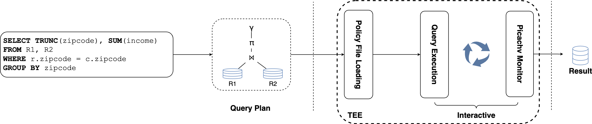
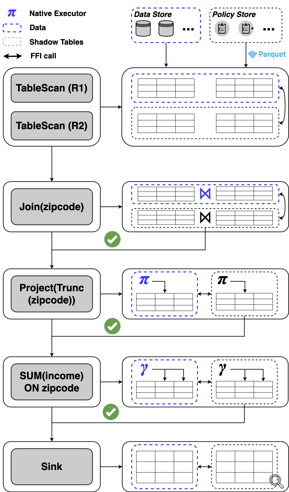

# Workflow
---

The high-level workflow of Picachv is rather simple:

1. The policymaker designs the policy and stores as separate files.
2. The researcher submit analytical tasks that can be interpreted as query plans.
3. The query plan is submitted to the query execution engines where Picachv will interact with query executors and enforce policies in the meantime.
4. If the query conforms with the policy then Picachv releases the results to the researchers.

What does query execution look like under the hood? We detail this process in the figure below.

